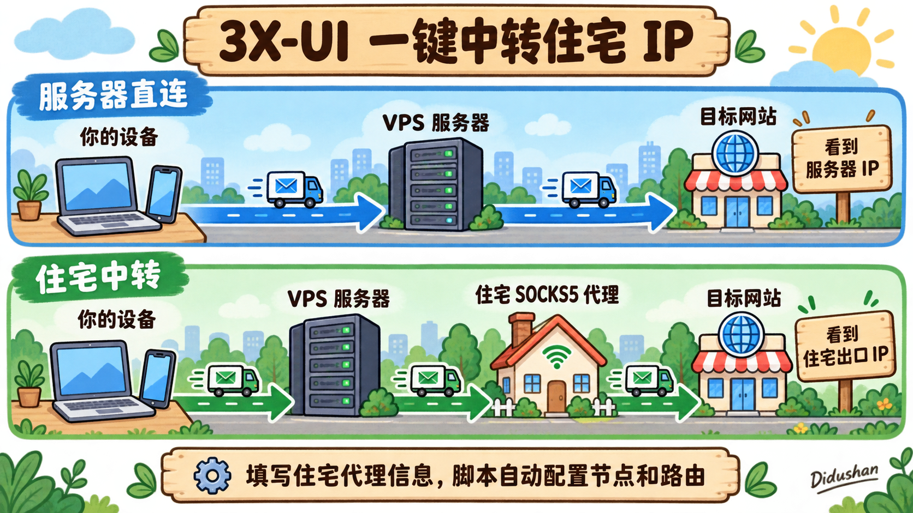

# 3X-UI 一键中转住宅 IP

**填入住宅代理信息，自动装好面板和中转节点。无需购买域名，也不用自己写路由规则。**

## 一、使用前准备

### 1. 一台 VPS 服务器

- 系统：**Ubuntu 22.04 及以上，或 Debian 12 及以上**。
- 架构：**x86_64（AMD64）或 ARM64**。
- 拥有公网 IPv4，使用 root 用户通过 SSH 登录。
- 使用全新系统，未安装其他 3X-UI 面板，避免配置冲突。脚本不会覆盖已有面板。

### 2. 一个住宅 SOCKS5 代理

提前准备代理商提供的四项信息：

- **连接地址**：域名或公网 IPv4。
- **端口**。
- **用户名**。
- **密码**。

这里填写的是代理商提供的连接地址，不带 `socks5://` 或端口，端口会单独询问。脚本不会提供或购买住宅 IP；如果代理商要求 IP 白名单，需要先加入你的 VPS 公网 IP。

仅支持 TCP 的住宅代理可以使用；支持 UDP 的代理也可以转发 UDP，实际连通性由脚本检测。

### 3. 一个常用邮箱

用于注册 HTTPS 证书申请账户，只需邮箱地址，不需要邮箱密码。无需购买域名。

### 4. 放行服务器端口

如果服务器有云安全组或防火墙，需要放行：

- **TCP 80**：用于申请和自动续期证书，需保持放行。
- **面板端口和两个节点端口**：脚本会显示具体数字，默认随机，也可自定义。

### 5. 一个代理客户端

准备支持 **VLESS + REALITY + XTLS Vision** 的客户端，用于导入和测试节点，例如 v2rayN、v2rayNG。建议更新客户端及其内核。

- **v2rayN**：[GitHub 最新版下载](https://github.com/2dust/v2rayN/releases/latest)。
- **v2rayNG**：[GitHub 最新版下载](https://github.com/2dust/v2rayNG/releases/latest)。

打开后，在页面的 **Assets** 中选择适合设备的安装包。

> 准备好服务器和住宅代理信息后，复制安装命令，按提示填写即可。脚本会自动安装面板、配置中转，并输出面板登录信息和两条节点链接。

## 二、一键安装

在**服务器的 SSH 终端**粘贴运行，按提示填写即可：

```bash
curl -fL 'https://raw.githubusercontent.com/Didushan/3xui-residential-relay/main/3xui-residential-relay.sh' -o /root/3xui-residential-relay.sh && bash /root/3xui-residential-relay.sh
```

## 三、原理阐述



这个脚本会在你的 VPS 上安装 3X-UI 面板，并自动配置两条节点。3X-UI 用来管理节点，实际转发流量的是它使用的 Xray 内核。

- **服务器直连节点**：你的电脑或手机 → VPS 服务器 → 目标网站，网站看到的是服务器 IP。
- **住宅中转节点**：你的电脑或手机 → VPS 服务器 → 住宅 SOCKS5 代理 → 目标网站，网站看到的是住宅代理的出口 IP。

住宅中转就是把服务器节点和住宅代理串起来，形成“链式代理”。你的客户端先通过 VLESS + REALITY + XTLS Vision 连接服务器，服务器再按脚本配置好的路由，把住宅节点的流量交给你填写的 SOCKS5 代理。

你只需要填写住宅代理信息，脚本会自动完成节点创建和路由绑定，并给出可导入客户端的链接。住宅 IP 由你的代理商提供，脚本负责配置中转。

## 四、装好后得到什么

- **面板登录信息**：打开输出的完整 HTTPS 地址，用给出的用户名和密码登录。
- **服务器直连节点**：上网时使用你的服务器 IP。
- **住宅中转节点**：先经过服务器，再从住宅代理上网，网站看到的是住宅出口 IP。

两条节点链接复制后，分别导入客户端测试。服务器上的自检通过后，仍要用自己的电脑或手机确认能连接。


## 五、日常管理（v1.1.2）

安装完成后，在服务器 SSH 中输入以下命令打开管理菜单：

```bash
3xui-relay
```

1. **查看节点与登录信息**：分区显示面板地址、账号密码和全部节点链接，方便查看与复制。

2. **添加住宅 IP**：填写新代理的地址、端口和账号密码，自动创建独立住宅节点并提供连接链接。

3. **检查全部节点**：逐个检查节点连接与出口，并显示 TCP、UDP、证书及续期定时器的检查结果。

4. **替换住宅代理**：更换所选节点的上游代理，保留原节点的连接地址、端口、UUID 和密钥。

5. **重命名住宅节点**：修改所选住宅节点的显示名称，脚本不主动重启代理服务。

6. **删除追加住宅节点**：删除后续添加的住宅节点及其对应路由，基础住宅节点不在删除范围内。

7. **脱敏诊断**：汇总不含密码和节点链接的运行状态，方便提供给维护人员排查问题。

8. **恢复中断操作**：根据保存的记录处理异常中断的变更，撤回未完成操作或保留已提交结果，不能找回已成功删除的节点。

9. **更新管理脚本**：下载并校验新版管理程序、备份旧版后替换，不升级面板或修改节点配置。

- **0. 退出**：关闭管理菜单，已运行的代理服务继续工作。

也可以直接更新管理脚本：

```bash
3xui-relay update
```

### 添加更多住宅 IP 的使用提示

- 进入菜单第 **2** 项，每次添加一个住宅代理，可重复添加；节点名称和端口均可自定义。
- 原有节点和面板账号保留；应用配置会短暂重启代理服务，已有连接可能需要重连。
- 按结果提示在云安全组或其他防火墙放行新节点的 **TCP 端口**，再导入客户端测试。
- 添加失败会尝试撤回本次变更；提示存在中断操作时，使用菜单第 **8** 项处理。

更新与异常恢复详见[维护与排查](docs/维护说明.md)，验证范围详见[开发与测试](docs/开发与测试.md)。

## 六、一键卸载

安装中途失败，或者装好了不想用，都可以运行下面的命令。**会删除本脚本安装的面板、节点、账号、证书及部署资料，原链接随即失效。** 卸载后可以重新安装。

```bash
curl -fL 'https://raw.githubusercontent.com/Didushan/3xui-residential-relay/main/uninstall-3xui-relay.sh' -o /root/uninstall-3xui-relay.sh && bash /root/uninstall-3xui-relay.sh
```

## 七、需要注意

- 安装的是 **3X-UI v3.7.0**。提示 REALITY 目标域名时，可先回车使用默认值；不需要你拥有这个域名。
- 住宅代理只支持 TCP 时，TCP 可以正常用；支持 UDP 且网络畅通时，UDP 也走住宅代理。住宅代理故障时，这个节点不会自动改用服务器 IP。
- 面板里新增的普通入站默认走服务器。新增住宅代理时，需要把对应入站绑定到住宅出站，参照现有住宅节点即可。
- 客户端请关闭 Mux。使用住宅节点时，让需要代理的应用和 DNS 都走代理，避免客户端自己的直连规则绕过节点。

安装失败、旧版本更新、查看日志，请看[维护与排查](docs/维护说明.md)。

作者 **Didushan** · [YouTube 频道](https://www.youtube.com/@Didushan) · [电报联系](https://t.me/didushan9)
